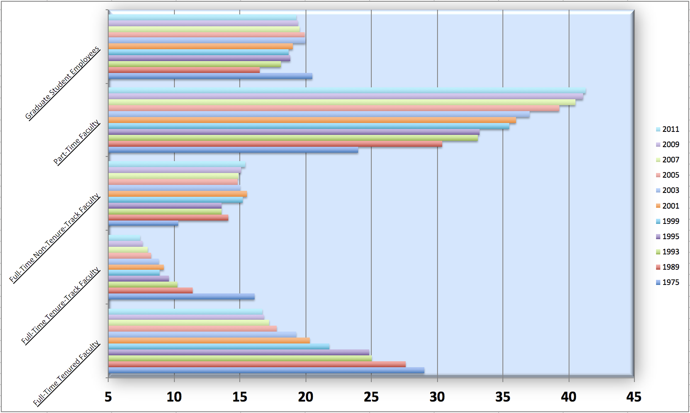
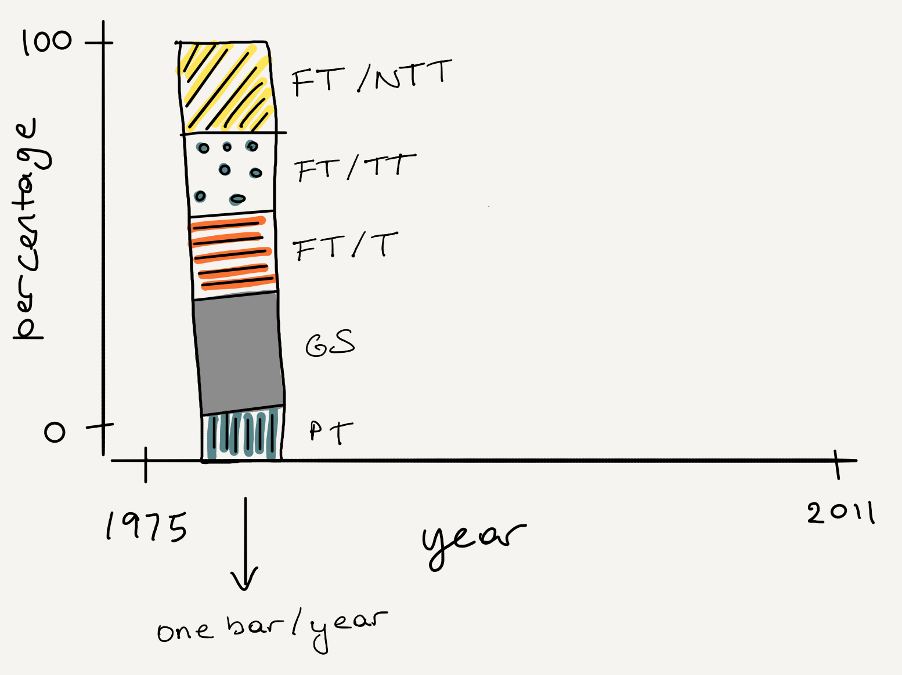
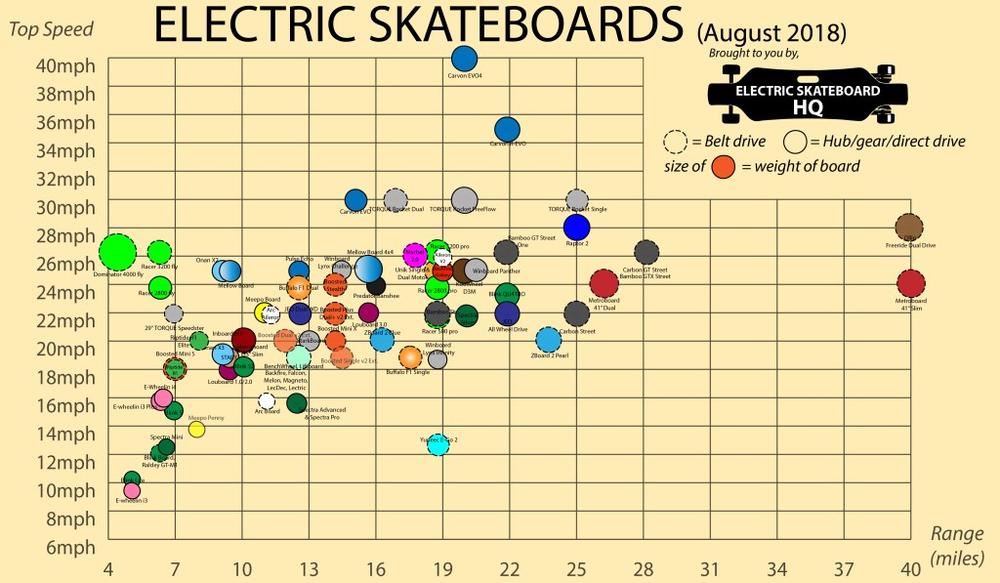
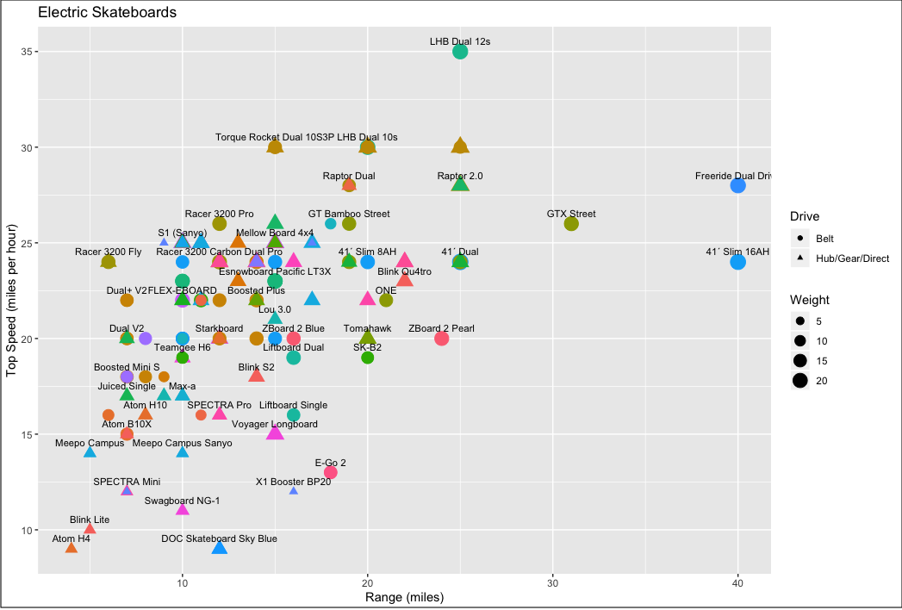

```{=html}
<style>
blockquote{
  font-size: 16px;
}
</style>
```
```{r setup, include=FALSE}
knitr::opts_chunk$set(echo = TRUE, 
                      warning = FALSE, 
                      message = FALSE,
                      fig.align = "center",
                      fig.height = 3,
                      out.width = "100%",
                      fig.retina = 3)
library(tidyverse)
library(scales)
library(knitr)
library(patchwork)
```

In our September 2014 column titled "Five concrete reasons your students should be learning to analyse data in the reproducible paradigm", we stated that "[a reproducible] workflow establishes the norm that data analysis and science in general should be an iterative process".
Just like data analysis in general, creating an effective data visualisation is also an iterative process.

It can be very inspirational to share highly polished data visualisations with students.
A few of our favourite visualisations to bring to the classroom are text analysis of Donald Trump's tweets by David Robinbson ([varianceexplained.org/r/trump-tweets](http://varianceexplained.org/r/trump-tweets/)), the Dialect Survey by Joshua Katz ([joshkatz.co/dialect.html](http://joshkatz.co/dialect.html)), and map of America's weather related disasters by Tim Meko ([washingtonpost.com/graphics/2019/national/mapping-disasters](https://www.washingtonpost.com/graphics/2019/national/mapping-disasters/)).
We also love the NY Times series What's Going on in This Graph?
([nytimes.com/column/whats-going-on-in-this-graph](https://www.nytimes.com/column/whats-going-on-in-this-graph)) as well as just about any visualisation from the Flowing Data blog by Nathan Yau ([flowingdata.com](https://flowingdata.com/)), The Pudding ([pudding.cool](https://pudding.cool/)), The Functional Art blog by Alberto Cairo ([thefunctionalart.com](http://www.thefunctionalart.com/)), and Chartable ([blog.datawrapper.de](https://blog.datawrapper.de/)).
For example, the stories on how the American work day changed over 15 years ([flowingdata.com/2019/07/16/how-the-american-work-day-changed-in-15-years](https://flowingdata.com/2019/07/16/how-the-american-work-day-changed-in-15-years)) and on gender tropes in film with screen direction ([pudding.cool/2017/08/screen-direction](https://pudding.cool/2017/08/screen-direction)) both feature in-depth and enlightening but simple visualisations that tell a meaningful story.
We like these examples because their message is clear enough to glean quickly, but one can extract deeper insights by looking at them for a bit longer and a bit more closely.

All of these visualisations share one thing in common -- they are incredibly polished.
It is possible for a student just starting off to think "well, I could never do that!".
Or perhaps worse, to think that they can, and get discouraged if they do not get to something as impressive on their first or second try.
We believe that it's important to show students not only the end result, but also the process of building a meaningful data visualisation.
This journey can be incredibly educational in its own, as each step of the improvement is an opportunity to teach a new data visualisation or wrangling technique.

In this column we present three examples of \`\`from drab to fab'' class activities, i.e. improving data visualisations.
The first example is about the types of instructional staff at American universities and how their distributions have changed over time.
We walk through this example in detail, showing some of the code and step-by-step improvements on the visualisations.
We then present two more examples of such activities, one on electric skateboards and the other on fisheries.
The data for all three examples along with R code to produce the visualisations presented here can be found in the GitHub repository accompanying this column at [bit.ly/taking-a-chance](http://bit.ly/taking-a-chance).

## The drab {.unnumbered}

The data come from The American Association of University Professors (AAUP), which is a nonprofit membership association of faculty and other academic professionals.
In 2013, the AAUP published a report on Trends in Instructional Staff Employment Status.
The plot shown in Figure \@ref(fig:staff-drab) is very similar to a plot presented in this report.

```{r staff-drab, echo=FALSE, fig.cap="Reproduction of visualisation included in the 2013 AAUP report on titled Trends in Instructional Staff Employment Status", out.width="60%"}

```

The visualisation is a bit difficult to make sense of, and this is the point.
We show this visualisation to the students at the beginning of the class, with some clarification on what the y-axis means (various levels of staff at the university who teach classes, ranging from graduate students to full-time tenured faculty) and ask them to interpret the visualisation in teams.
Eventually students are able to identify the main message of the story: the highest proportion of instructors are part-time faculty, and this proportion has been increasing from 1975 to 2011.
Along with this main message, students also naturally come to the conclusion that this is not the best visualisation of these data, and in fact, the visualisation hides the main message instead of making it loud and clear.

At this point it's a worthwhile exercise to ask students to start thinking about how this visualisation can be improved.
Instead of just talking through it, we ask students to sketch the visualisations on a piece of paper.
They're not expected to actually create an accurate visualisation via a sketch, but we recommend they label their axes, mark their axis ranges, and decide on which geometric object(s) they plan on using to represent their data (points, lines, bars, etc.).
Figure \@ref(fig:staff-sketch) is an example of such a sketch.

```{r staff-sketch, echo=FALSE, fig.cap="Example of sketch of redesigned visualisation.", out.width="60%"}

```

The process of having to think through what the end result should look like, and especially having put it down on paper with a sketch, gives the students a path to follow in the next step when they're using software to build this improved visualisation.

## Onto the fab {.unnumbered}

Next we walk through the steps for improving this visualisation.
One can do this during class, with interactive exercises and just-in-time teaching sprinkled throughout, or give it as an assignment students work on outside of class.
For the latter, we have had success in assigning this as a team exercise in which students write a critique of the original visualisation and then create an improved one.
After a few days, teams present their visualisations during class while describing how they have improved upon the original one.
If the class size allows, it's also a great idea to then have students present their process (both technical and thought processes) for improving the visualisation, so they can see the various approaches each team has taken.

In the walk through of a possible path to "fab" (an improved visualisation) that we present below, we highlight opportunities for instruction along the way, using R as the programming language and the **tidyverse** suite of packages.
We also present a series of questions that can be used as part of a class activity or assignment.
We deliberately keep steps simple, improving only one or two features of the visualisation at a time, in an effort to emphasize that creating an effective data visualisation is an iterative process.
The visualisations in this path are representative of the variety of those created by students across multiple semesters of doing this assignment in introductory data science courses.

### Step 1. Get the data {.unnumbered}

The dataset provided in the AAUP report is in the following format, and this is exactly how we recommend showing it to the students before distributing it.

```{r staff-wide, echo=FALSE, message=FALSE}
staff_wide <- read_csv("data/instructional-staff.csv")
staff_wide %>% kable("latex", booktabs = TRUE)
```

> ***Question 1.** What does each row in the dataset represent? What does each column represent? What do the numbers represent? What does each column add up to, and why?*

We can load the data frame using the following, and call it `staff_wide`.

```{r load-staff-show, eval=FALSE}
library(tidyverse)
staff_wide <- read_csv("http://bit.ly/chance-staff")
```

### Step 2. Reshape the data {.unnumbered}

Our goal is to create a visualisation similar to the sketch in Figure \@ref(fig:staff-sketch).
In order to do this we need a column for year, a column for percentage, and a column for instructional staff type.
However, our dataset is currently not in this format.
This presents a great opportunity for some just-in-time teaching for reshaping data from wide to long format.
This data wrangling step is quite common when working with time series and with repeated measures data, and hence it's a useful skill for students to have.

> ***Q2.** If the long data will have a row for each year/faculty type combination, and there are 5 faculty types and 11 years of data, how many rows will the long data have?*

We can accomplish this task using the `pivot_longer()` function, which also has a counterpart `pivot_wider()` for going from long to wide datasets.
In the next code chunk we start with the wide dataset and we pivot all of its columns except for faculty type (`cols = -faculty_type`), placing column names in a new variable called `year` and placing the values in the original data frame in a new variable called `percentage`.

```{r staff-long}
staff_long <- staff_wide %>%
  pivot_longer(cols = -faculty_type, names_to = "year", values_to = "percentage") 
```

```{r staff-long-show, echo=FALSE}
staff_long %>%
  print(n = 5)
```

> ***Q3.** What does each row represent in the long dataset? How does this differ from what each row represents in the wide dataset?*

### Step 3. Recreate the plot {.unnumbered}

A good way to get started with improving a visualisation is to first recreate it.
We can do that by placing `percentage` on the x-axis and `faculty_type` on the y-axis and filling the bars by `year`.

```{r drab, fig.height=3.2}
ggplot(data = staff_long, aes(x = percentage, y = faculty_type, fill = year)) +
  geom_col(position = "dodge")
```

Now that we know we can match our starting point (we haven't matched it exactly, but we're close enough to be confident that we're working with the same data), we can start making improvements to work towards the visualisation in our sketch.

### Step 4. Recreate the sketch {.unnumbered}

We'll start by changing variable mappings to certain aesthetics of the plot, like which variables are on the `x` and `y` axes and which variable determines how we `fill` the bars.

```{r fab1, fig.height=2}
ggplot(data = staff_long, aes(x = year, y = percentage, fill = faculty_type)) +
  geom_col(position = "dodge")
```

> ***Q4.** In what way(s) is this plot an improvement on the original "drab" visualisation?*

> ***Q5.** In what way(s) is the main message still unclear / hidden?*

Next, let's convert it to a segmented bar plot by changing the position of the columns from `dodged` to `fill`.
This not only looks like our sketch, but it also is starting to tell the story of increasing percentages of part-time faculty instructional faculty over the years.

```{r fab2, fig.height=2}
ggplot(data = staff_long, aes(x = year, y = percentage, fill = faculty_type)) +
  geom_col(position = "fill")
```

> ***Q6.** In what way(s) is the segmented bar plot an improvement on the the side-by-side bar plot from the previous step?*

> ***Q7.** In what way(s) is the main message still unclear / hidden?*

### Step 5. Improve further {.unnumbered}

Most students will get to this point and call it a day once they have successfully created the plot they envisioned in their sketch using R.
This presents a good opportunity to get them to think about alternate geometric objects to represent the data.
For example, line plots are common in time series data, so they are worth a try.

```{r fab3, fig.height=2}
ggplot(staff_long, aes(x = year, y = percentage/100, group = faculty_type, 
                       color = faculty_type)) +
  geom_line()
```

The lines are an improvement over the bars, but let's take a look at the x-axis.
When the data was reshaped in Step 1, `year` was stored as a character variable.
Therefore, the years are sorted alphabetically (which happens to match the numerical sorting) and are equally spaced in our visualisation, giving the impression that the data were collected at equally spaced time intervals.

Let's fix this by first transforming `year` to be a numerical variable:

```{r mutate-year}
staff_long <- staff_long %>% mutate(year = as.numeric(year))
```

and then re-plotting the data.

```{r fab4, fig.height=2}
ggplot(staff_long, aes(x = year, y = percentage, group = faculty_type,
                       color = faculty_type)) +
  geom_line()
```

> ***Q8.** If the main goal of this visualisation is to draw attention to the increasing percentage of part-time faculty over the years, how can we make this message stronger?*

One option is to use colors to draw attention to the part-time faculty line.
We can accomplish this by creating a binary variable (`part_time`) that indicates whether the faculty type is part-time or something else.
The `fct_other()` function is one quick and straightforward way of accomplishing this.
Then, we can use red to indicate part-time and a much more muted colour (gray) to indicate all other categories

```{r fab5, fig.height=2}
staff_long <- staff_long %>%
  mutate(part_time = fct_other(faculty_type, keep = "Part-Time Faculty"))

ggplot(staff_long, aes(x = year, y = percentage/100, group = faculty_type, 
                       color = part_time)) +
  geom_line() +
  scale_color_manual(values = c("red", "gray"))
```

Now the main message of the story is clear: the highest proportion of instructors are part-time faculty, and this proportion has been increasing from 1975 to 2011.
In the previous line plots, it was unclear where one should focus their attention since each faculty type was a distinct and vibrant colour.
By making the lines for the other faculty levels gray, one is still able to see their trends without distracting from the trend of the primary group of interestin this story, part-time faculty.

### Step 6. Formatting and annotation {.unnumbered}

There are still a number of features of this plot that could use improving:

1.  Percentages are missing the % sign (we'll use the `percent_format()` function from the **scales** package for this).
2.  The labels are poorly formatted and the data source is not indicated.
3.  The gray lines on gray background don't offer much contrast.
4.  The legend is taking up too much space on the right hand side.

Suppose we store the plot from the previous step as `p`.
Then, we can add the necessary layers to `p` to address these updates.
The improved \`\`fab'' visualisation is in \@ref(fig:fab6).

```{r save-fab5, echo=FALSE}
p <- ggplot(data = staff_long, aes(x = year, y = percentage/100, 
                              group = faculty_type, color = part_time)) +
  geom_line() +
  scale_color_manual(values = c("red", "gray"))
```

```{r fab6, fig.height=3, fig.cap="Improved \``fab\'' visualisation of instructional staff employment trends 1975 - 2011."}
library(scales)
p +
  scale_y_continuous(labels = percent_format(accuracy = 1)) +             # %s
  labs(                                                                   # labels
    title = "Percentage of part-time faculty instructors is on the rise",
    x = "Year", y = "Percentage", color = "",
    caption = "Source: bit.ly/taking-a-chance"
  ) +
  theme_minimal() +                                                       # background
  theme(legend.position = "bottom")                                       # legend 
```

## Similar exercises {.unnumbered}

### Electric skateboards {.unnumbered}

Electric Skateboard HQ is a review and discussion site on, you guessed it, electric skateboards.
They summarise their comparison of various electric skateboards using a visualisation similar to the one in Figure \@ref(fig:skateboard-drab).
The original visualisation can be found on the Electric Skateboard HQ website ([electricskateboardhq.com/boards-comparison/](https://www.electricskateboardhq.com/boards-comparison/)).
The primary issue with this visualisation is that it's trying to convey too much information at once, and hence it is a good example to discuss the appropriate level of information any single visualisation should convey.

```{r load-skateboard, echo = F}
skateboard <- read_csv("data/skateboard.csv")
```

```{r skateboard-drab, echo=FALSE, fig.cap="Reproduction of visualisation to compare  electronic skateboards on the Electric Skateboards HQ website.", out.width = '75%'}
#

```

The data used to create this plot can be found at [bit.ly/chance-skateboard](http://bit.ly/chance-skateboard).
A class activity / assignment around this example should begin by having the students list of all the variables included in this visualisation and how they are represented:

-   Relationship between the top speed and the range (points on x and y axis)
-   Company (colour of points)
-   Weight of electric skateboard (size of points)
-   Type of drive (shape of points)
-   Name of electric skateboard (label for each point)

Figure \@ref(fig:skateboard-fab) shows the evolution of visualisations we can make in improving this plot.
The most clear information we get from this visualisation is the relationship between the top speed and the range.
Therefore, we can start by making a plot that just examines the relationship between these two variables (Plot I).
Then, we add colour to include information on weights (Plot II), and finally, we can use we can facet the plot based on the drive (belt vs. hub/gear/direct) as well as use proper labels and an informative title (Plot III).

```{r skateboard-fab, echo=FALSE, fig.cap="Plot I: Top speed vs. Range, 2. Plot II: I + coloring by weight, 3. Plot III: II + faceting and formatting", fig.height=5}
p1 <- ggplot(skateboard, aes(x = range, y = top_speed)) +
  geom_point()
p2 <- ggplot(skateboard, aes(x = range, y = top_speed, color = weight)) +
  geom_point()
p3 <- skateboard %>%
  mutate(is_belt = if_else(drive == "Belt", "Belt", "Hub/Gear/Direct")) %>%
  ggplot(aes(x = range, y = top_speed, color = weight)) +
  geom_smooth(method = "lm", color = "darkgray") +
  geom_point() + 
  scale_color_viridis_c() +
  scale_y_continuous(breaks = c(10, 20, 30)) +
  facet_wrap(~is_belt, ncol = 1) + 
  labs(title = "Specifications for electric skateboards",
       subtitle = "by drive type",
       x = "Range (miles)", y = "Top speed (mph)", 
       color = "Weight
(lbs)"
       ) +
  theme_minimal() +
  theme(panel.grid.minor = element_blank())
p1 + p2 - p3 + 
  plot_layout(ncol = 1, heights = c(1, 2)) +
  plot_annotation(tag_levels = "I", tag_prefix = "Plot ") & 
  theme(plot.tag = element_text(size = 12))
```

### Fisheries of the world {.unnumbered}

The final example is on fishing harvest of countries around the world.
The data come from Wikipedia article titled [*Fishing industry by country*](https://en.wikipedia.org/wiki/Fishing_industry_by_country).
Figure \@ref(fig:fisheries-drab) shows the "drab" starting point for this exercise.

```{r fisheries-drab, echo=FALSE, fig.cap = "Starting point for the fisheries exercise.", out.width="80%"}
knitr::include_graphics("img/fisheries.png")
```

The fishery data for used to create this plot may be found at [bit.ly/chance-fishery](http://bit.ly/chance-fishery).
In this dataset each row represents a country, and for each country we have fishing harvest data for 2016 from capture, aquaculture (fish farming), and the total harvest, in metric tonnes.
This exercise presents an opportunity for teaching how to join data frames, which is an incredibly useful skill for working with data coming from multiple sources.
If wanting to keep the exercise simple, we can join the fishery data with continent information (we have provide the continent data at [bit.ly/chance-continent](http://bit.ly/chance-continent)).
This also presents an opportunity to talk about how one might need to make contextual decisions while preparing their data for analysis -- some of the countries in the fishery dataset (e.g. Hong Kong) do not appear on the continent lookup dataset.
The discussion around how to address this is an opportunity to convey to students concerns around ethics in data science and how decisions we make in data wrangling and modelling might sometimes be subjective.
Figure \@ref(fig:fisheries-improve1) presents an example of a simple but improved data visualisation for a continent level analysis of these data.

```{r fisheries-improve1, echo=FALSE, fig.height=2, fig.cap = "Continent level visualisation of fisheries data."}
fisheries <- read_csv("data/fisheries.csv")
continents <- read_csv("data/continents.csv")
fisheries <- fisheries %>%
  filter(total > 100000) %>%
  left_join(continents) %>%
  mutate(
    continent = case_when(
      country == "Democratic Republic of the Congo" ~ "Africa",
      country == "Hong Kong"                        ~ "Asia",
      country == "Myanmar"                          ~ "Asia",
      TRUE                                          ~ continent
    ),
    aquaculture_perc = aquaculture / total
  )
fisheries_summary <- fisheries %>%
  group_by(continent) %>%
  summarise(
    min_ap  = min(aquaculture_perc),
    mean_ap = mean(aquaculture_perc),
    max_ap  = max(aquaculture_perc)
  ) 
ggplot(fisheries_summary, 
       aes(x = reorder(continent, mean_ap), y = mean_ap)) +
  geom_col() +
  coord_flip() +
  scale_y_continuous(labels = percent_format(accuracy = 1)) + #<<
  labs(
    x = "", y = "",
    title = "Average share of aquaculture by continent",
    subtitle = "out of total fisheries harvest, 2016",
    caption = "Source: bit.ly/chance-fishery"
  ) +
  theme_minimal()
```

For a slightly more advanced activity, we map these data.
This will require a discussion around basics of making maps in R and shapefiles.
Fortunately, there is plenty of built-in functionality in the **ggplot2** package for making country level maps.
Despite the code required for mapping not being too complicated, this exercise can still ignite plenty of discussion around missing data, specifically how to represent countries for which we don't have any data on a map.
Figure \@ref(fig:fisheries-improve2) presents an example of a choropleth map of the distribution of percentage of aquaculture across the globe.

```{r fisheries-improve2, echo=FALSE, fig.height=4.2, fig.cap = "Choropleth map of percentage of aquaculture.", out.width="80%"}
fisheries <- fisheries %>%
  filter(total > 100000) %>%
  left_join(continents) %>%
  mutate(
    continent = case_when(
      country == "Democratic Republic of the Congo" ~ "Africa",
      country == "Hong Kong"                        ~ "Asia",
      country == "Myanmar"                          ~ "Asia",
      TRUE                                          ~ continent
    ),
    aquaculture_perc = aquaculture / total
  )
world_map <- map_data("world") %>%
  mutate(region = case_when(
    region == "UK"           ~ "United Kingdom",
    region == "USA"          ~ "United States",
    subregion == "Hong Kong" ~ "Hong Kong",
    TRUE                     ~ region
    )
  )
fisheries_map <- left_join(fisheries, world_map, 
                           by = c("country" = "region"))
fisheries_map <- fisheries_map %>%
  mutate(
    aquaculture_perc = aquaculture / total
  )

ggplot() +
  geom_polygon(world_map, 
               mapping = aes(x = long, y = lat, group = group), 
               fill = "lightgray") +
  geom_polygon(fisheries_map, 
               mapping = aes(x = long, y = lat, group = group, 
                             fill = aquaculture_perc)) +
  scale_fill_viridis_c(labels = percent_format(accuracy = 1)) +
  theme_minimal() +
  theme(
    legend.position = "bottom", 
    legend.box = "vertical"
    ) +
  labs(
    title = "Share of aquaculture by country",
    subtitle = "out of total fisheries harvest, 2016",
    caption = "Source: bit.ly/chance-fishery",
    x = "", y = "",
    fill = "Aquaculture %"
  )
```

This activity can also be restructured as a web scraping exercise, where students first scrape the data from Wikipedia, and then dive into visualisation.

## Conclusion {.unnumbered}

In this column we gave three examples of "from drab to fab" visualisation activities, and for each one we highlighted other topics you can introduce along with data visualisation.
You can find the data, the code for reproducing the figures we presented, and links to the additional resources we mentioned in the GitHub repository for this column at [bit.ly/taking-a-chance](http://bit.ly/taking-a-chance).

## Further reading {.unnumbered}

1.  Wickham et al., (2019). Welcome to the tidyverse. Journal of Open Source Software, 4(43), 1686, <https://doi.org/10.21105/joss.01686>.
2.  "Fishing industry by country." Wikipedia, Wikimedia Foundation, 12 February 2020,\
    [en.wikipedia.org/wiki/Fishing_industry_by_country](https://en.wikipedia.org/wiki/Fishing_industry_by_country).
3.  Healy, K., (2019). *Data Visualization: A Practical Introduction*. Princeton University Press.
